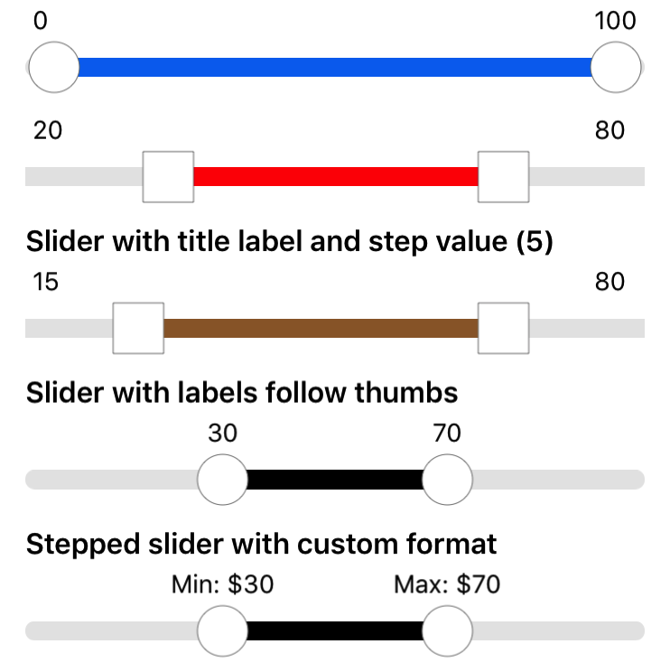

# NHRangeSlider
&nbsp;[](https://github.com/Carthage/Carthage)&nbsp;[](https://github.com/thehung111/NHRangeSlider)


A custom range slider in Swift. Forked from [RangeSlider](https://github.com/warchimede/RangeSlider) with some enhancements.



## Requirements

- iOS: 8.0+
- Xcode 8.1+
- Swift 3.0+

## Installation

### CocoaPods

> CocoaPods 1.1.0+ is required to build NHRangeSlider.

```ruby
source 'https://github.com/CocoaPods/Specs.git'
platform :ios, '10.0'
use_frameworks!

target '<Your Target Name>' do
    pod 'NHRangeSlider', '~> 0.1'
end
```
You should change version 0.1 to the latest version of NHRangeSlider. The version numbers can be viewed under the current Github project tags.

Then, run the following command:

```bash
$ pod install
```

### Carthage

Put the following in your Cartfile:

```ogdl
 github "thehung111/NHRangeSlider" ~> 0.1
```
 
 You should change version 0.1 to the latest version of NHRangeSlider. The version numbers can be viewed under the current Github project tags.

Run `carthage update --platform iOS --no-use-binaries` 

## Usage

### Default Slider

By default, the title label is not shown and the left and right thumbs will be circles (`curvaceousness` set to 1). You can add the view in code or via story board:

```swift
 override func viewDidLoad() {
    super.viewDidLoad()
    
    // default slider. Configure the frame
    let sliderView = NHRangeSliderView(frame: CGRect(x: 16, y: 20, width: self.view.bounds.width - 32, height: 80) )
    // call size to fit to resize the height to fit exactly
    sliderView.sizeToFit()
    self.view.addSubview(sliderView)

}
```

### Slider with Square Thumbs

```swift
let sliderSquareView = NHRangeSliderView(frame: ...)

// set to 0 for square
sliderSquareView.curvaceousness = 0.0

sliderSquareView.trackHighlightTintColor = UIColor.red
sliderSquareView.lowerValue = 20.0
sliderSquareView.upperValue = 80.0
sliderSquareView.sizeToFit()
self.view.addSubview(sliderSquareView)
``` 

### Slider with title

```swift
let sliderSquareWithLabelView = NHRangeSliderView(frame: ...)
sliderSquareWithLabelView.curvaceousness = 0.0
sliderSquareWithLabelView.trackHighlightTintColor = UIColor.brown
sliderSquareWithLabelView.lowerValue = 20.0
sliderSquareWithLabelView.upperValue = 80.0

// set title text
sliderSquareWithLabelView.titleLabel?.text = "Slider with title label"

sliderSquareWithLabelView.sizeToFit()
self.view.addSubview(sliderSquareWithLabelView)
```

### Slider with labels following thumbs

```swift
let sliderWithLabelFollowView = NHRangeSliderView(frame: ...)
sliderWithLabelFollowView.trackHighlightTintColor = UIColor.black
sliderWithLabelFollowView.lowerValue = 30.0
sliderWithLabelFollowView.upperValue = 70.0
sliderWithLabelFollowView.gapBetweenThumbs = 5

// set style to follow
sliderWithLabelFollowView.thumbLabelStyle = .FOLLOW

sliderWithLabelFollowView.titleLabel?.text = "Slider with labels follow thumbs"
sliderWithLabelFollowView.sizeToFit()
self.view.addSubview(sliderWithLabelFollowView)
```

## Configuration

The range slider view (**NHRangeSliderView**) can be customized and information can be accessed through these properties :

  + `titleLabel` : label for title (optional)
  + `lowerLabel` : label for lower thumb
  + `upperLabel` : label for upper thumb
  + `minimumValue` : The minimum possible value of the range
  + `maximumValue` : The maximum possible value of the range
  + `lowerValue` : The value corresponding to the left thumb current position
  + `upperValue` : The value corresponding to the right thumb current position
  + `trackTintColor` : The track color
  + `trackHighlightTintColor` : The color of the section of the track located between the two thumbs
  + `thumbTintColor`: The thumb color
  + `thumbBorderColor`: The thumb border color
  + `thumbBorderWidth`: The width of the thumb border
  + `curvaceousness` : From 0.0 for square thumbs to 1.0 for circle thumbs
  + `displayStringFormat` : display format for lower and upper thumb values. Default to `%.0f` to display value as Int. Change this if you need to display decimal places.
  + `spacing` : vertical spacing between the labels and thumbs
  + `thumbLabelStyle` : position of thumb labels. Set to STICKY to stick to left and right positions. Set to FOLLOW to follow left and right thumbs 
  + `gapBetweenThumbs` : minimum distance between thumbs

  To listen for value changes event, you can set the delegate (`NHRangeSliderViewDelegate`): sliderValueChanged(slider:)

## API Reference

[https://thehung111.github.io/NHRangeSlider/](https://thehung111.github.io/NHRangeSlider/)


